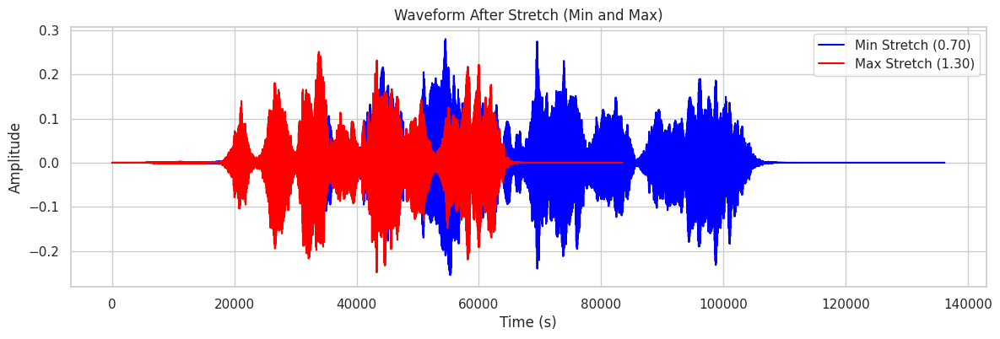

# Speech Emotion Detection - Neural Network Ensemble Model

## Introduction

This project explores the development of a neural network ensemble model for effective speech emotion detection. Speech emotion detection has important applications in areas such as human-computer interaction, mental health analysis, and customer service.

## Datasets

* Ravdess [Sample Audio File](./soundfiles/ravdess.wav)
* Ravdess Song
* SAVEE
* CREMA D
* TESS

**All Datasets with Emotions**

**Final Balanced Dataset with 6 emtions**

## Methodology

**Data Augmentation:**
* **add_echo()**: Adds an echo effect to the audio, simulating sound reflections.
* **add_background_noise()**: Mixes in realistic background noise from a provided audio file.
* **match_duration() / match_length()**: Makes audio clips a consistent length by repeating or trimming the audio.
* **add_reverb()**: Simulates reverberation, creating the sense of audio occurring within a space.
* **stretch()**: Changes the speed of the audio without affecting its pitch.

* **shift()**: Applies a circular time shift to the audio.
* **pitch()**: Changes the pitch of the audio without affecting the speed.

**Feature Extraction:** 
* **MFCCs (Mel-Frequency Cepstral Coefficients):** Capture the shape of the vocal tract, commonly used in speech recognition and other audio tasks.
* **Delta MFCCs:** Measure the changes in MFCCs over time, providing dynamic information.
* **Acceleration MFCCs:**  Calculate the second-order derivative of MFCCs, emphasizing higher-order spectral changes.
* **Mel Spectrogram:** A visual representation of the audio's frequency content over time, useful for analyzing various audio patterns.
* **FRFT (Fractional Fourier Transform):** A generalization of the Fourier transform, it allows extracting features at intermediate points between the time and frequency domains.
* **Spectral Centroid:**  Indicates where the "center of mass" of the spectrum is located, related to the brightness of the sound.

**Preprocessing:**
* **Loading and Resampling:** Loads audio files and resamples them to a consistent sample rate. 
* **Silence Trimming:** Removes leading and trailing silence from the audio.
* **Normalization:** Adjusts audio amplitude to a standard range.

# Neural Network Ensemble Architecture

This project utilizes an ensemble of neural networks for enhanced performance and robustness. The ensemble includes the following models:

**Model 1: CNN, LSTM, GRU with Attention** 
* Employs a Convolutional Neural Network (CNN) for feature extraction.
* Includes Long-Short Term Memory (LSTM) and Gated Recurrent Unit (GRU) layers to process sequential data.
* Incorporates an attention mechanism to focus on the most relevant features.

**Model 2: CNN Only**
* Features a streamlined CNN-based architecture for feature extraction.

**Model 3: CNN and LSTM**
* Combines CNN feature extraction with an LSTM layer for processing sequences and potentially capturing longer-term dependencies.

**Model 4: CNN and GRU**
* Employs CNN for feature extraction, followed by a Gated Recurrent Unit (GRU) layer for sequential processing (an alternative to the LSTM in Model 3).

**Model 5: CNN, Bidirectional LSTM, Bidirectional GRU with Multi-Head Attention**
* Leverages CNN for feature extraction.
* Utilizes bidirectional LSTM and GRU layers for capturing information from both past and future contexts.
* Employs multi-head attention to focus on various aspects of 

## Results

* Summarize performance metrics

* Discuss key findings from cross-corpora testing.

## Process Flow

* **Process Flow Diagram:** 

## Code Structure

* **ensemble_full_final:** (Explain the purpose of this file)
* **Predictor_final:** (Describe the functionality of this file)

## How to Run

1. **Set up environment:** (List dependencies, Python version, etc.)
2. **Download datasets:** (If applicable, provide download instructions)
3. **Execute ensemble_full_final:** (Explain any arguments or parameters required)
4. **Run Predictor_final:** (Explain any arguments or parameters required)

## Future Work

* (List potential areas for improvement or expansion)

## Contact

* (Provide your contact information for questions or feedback) 
