# Speech Emotion Detection - Neural Network Ensemble Model

## Introduction

This project explores the development of a neural network ensemble model for effective speech emotion detection. By utilising diverse datasets, employing advanced feature extraction techniques, and developing robust a machine learning model, SER system capable of identifying and classifying a wide range of emotions has been usccessfully dveloped. The ultimate goal was to develop a Sentiment Emotion Recognition (SER) system for analyzing political discourse. This involved iterative testing until finally applying it to the 1st debate between Trump and Biden.


## Key Result - 1st Debate Biden & Trump - Final Segment

The key result is based on a video and transcript 2020 Joe Biden Donald Trump 1st Debate Part 2 (2020), hosted on rev.com and specifically the final segment. This section of the debate was used as they are both addressed the same question, both given the same amount of time by the host to answer, two minutes, and therefore this can be considered a clean comparison. For this reason, we do not see the ‘Anger’ spike noted and discussed widely from this debate, at no time do they interpret each other during this segment. 

* Trump Cut (using online tool) [Trump Segment Used for Analysis](./soundfiles/trump_cut.wav)
* Biden Cut [Biden Segment Used for Analysis](./soundfiles/biden_cut.wav)

* window_size = 1.0
* hop_size = 0.2
* confidence_threshold =0.7

**Trump Radar Chart**


**Trump Bar Chart**

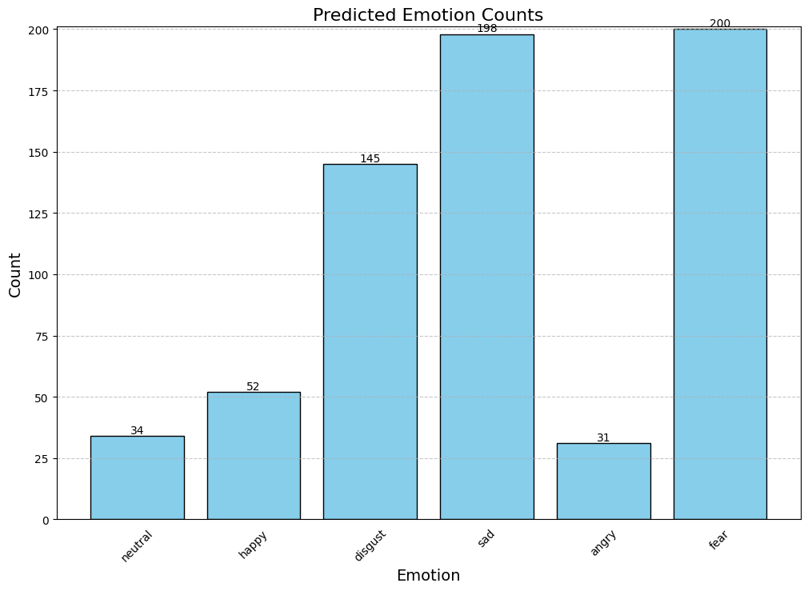

---

**Biden Radar Chart**


**Biden Bar Chart**

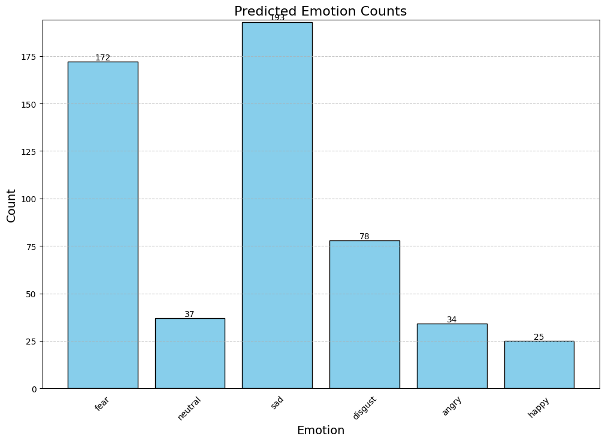

Radar charts offer a valuable method for visually representing the emotional content conveyed during debates. They suggest that both Trump and Biden displayed negative emotions, but Trump's disgust was more noticeable. This finding aligns with previous studies on political communication, indicating that voters tend to be influenced more by negative emotions than positive ones.

The use of fear and sadness in political discussions is nothing new. Politicians have been employing these emotions for centuries to convince and energize their supporters. However, the frequency with which these emotions are utilised has changed over time. In recent years, there has been a shift towards a more negative and fear driven approach in political messaging. This may be influenced by various factors, including the rise of social media, the fragmentation of media platforms and the increasing importance of partisan identity. Regardless of the reasons, it is likely that fear and sadness will continue to play a role in political discourse since negativity tends to be more effective than positivity in most aspects of life, especially in politics.


## Datasets

* Ravdess [Sample Audio File](./soundfiles/ravdess.wav)
* Ravdess Song [Sample Audio File](./soundfiles/rav_song.wav)
* SAVEE [Sample Audio File](./soundfiles/savee.wav)
* CREMA D [Sample Audio File](./soundfiles/CremaD.wav)
* TESS [Sample Audio File](./soundfiles/tess.wav)

*Disclaimer: Audio files cannot be directly played within the README.Please click the links to download and listen to the sample files.*

**All Datasets with Emotions**


---

**Final Balanced Dataset with 6 emtions**


## Methodology

**Data Augmentation:**
* **add_echo()**: Adds an echo effect to the audio, simulating sound reflections.
* **add_background_noise()**: Mixes in realistic background noise from a provided audio file.
* **match_duration() / match_length()**: Makes audio clips a consistent length by repeating or trimming the audio.
* **add_reverb()**: Simulates reverberation, creating the sense of audio occurring within a space.
* **stretch()**: Changes the speed of the audio without affecting its pitch.
* **shift()**: Applies a circular time shift to the audio.
* **pitch()**: Changes the pitch of the audio without affecting the speed.


**Feature Extraction:** 

The extracted features are stacked in sequential order, with MFCCs as the first feature. This stacking ensures that the extracted features are presented in a consistent format, facilitating their subsequent use in emotion classification models. MFCC's being the most widely utilised along with Mel Spectograms in SER Studies, with food reason, through expirmntions you will see that they garner the best results. Feature extraction techniques like MFCCs allowed the model to capture subtle variations in voice pitch, tone, and rhythm – all vital cues for recognizing emotions. 

* **MFCCs (Mel-Frequency Cepstral Coefficients):** Capture the shape of the vocal tract, commonly used in speech recognition and other audio tasks.
* **Delta MFCCs:** Measure the changes in MFCCs over time, providing dynamic information.
* **Acceleration MFCCs:**  Calculate the second-order derivative of MFCCs, emphasizing higher-order spectral changes.
* **Mel Spectrogram:** A visual representation of the audio's frequency content over time, useful for analyzing various audio patterns.
* **FRFT (Fractional Fourier Transform):** A generalization of the Fourier transform, it allows extracting features at intermediate points between the time and frequency domains.
* **Spectral Centroid:**  Indicates where the "center of mass" of the spectrum is located, related to the brightness of the sound.


**Load the Audio Data, extract Features, normalize and trim, and add augmentations:**
* **Loading and Resampling:** Loads audio files and resamples them to a consistent sample rate. 
* **Silence Trimming:** Removes leading and trailing silence from the audio.
* **Normalization:** Adjusts audio amplitude to a standard range.

```python
def get_features(path, background_noise_path, target_sample_rate=16000, target_duration=3.0):
    try:
        # Load the audio file with the desired sample rate
        data, sample_rate = librosa.load(path, sr=target_sample_rate)

        # Trim silence on the entire duration
        try:
            trimmed_data, _ = librosa.effects.trim(data)
        except Exception as trim_error:
            raise ValueError(f"Error trimming silence for file: {path}. Error details: {str(trim_error)}")

        # Normalize the trimmed audio data
        normalized_data = normalize_audio(trimmed_data)

        # Ensure the audio is exactly 3 seconds long (truncate or pad)
        if len(normalized_data) > int(target_duration * target_sample_rate):
            normalized_data = normalized_data[:int(target_duration * target_sample_rate)]
        else:
            # Pad with zeros if the audio is shorter than 3 seconds
            pad_length = int(target_duration * target_sample_rate) - len(normalized_data)
            normalized_data = np.pad(normalized_data, (0, pad_length), 'constant')

        # Print the duration
        duration_seconds = len(normalized_data) / target_sample_rate
        print(f"Duration of {path}: {duration_seconds} seconds")

        # Initialize a list to store features
        features_list = []

        # Extract features from the entire normalized audio
        try:
            res1 = extract_features(normalized_data, sample_rate)
            features_list.append(res1)
        except Exception as feature_error:
            raise ValueError(f"Error extracting features for file: {path}. Error details: {str(feature_error)}")

        # Data with background noise
        noise_data = add_background_noise(normalized_data, background_noise_path)
        res2 = extract_features(noise_data, sample_rate)
        features_list.append(res2)

        # Data with stretching and pitching
        new_data = stretch(normalized_data)
        data_stretch_pitch = pitch(new_data, sample_rate)
        res3 = extract_features(data_stretch_pitch, sample_rate)
        features_list.append(res3)

        # Data with shifting
        shift_data = shift(normalized_data)
        res4 = extract_features(shift_data, sample_rate)
        features_list.append(res4)

        # Data with echo
        echo_data = add_echo(normalized_data, sample_rate)  # Adjust the echo parameters as needed
        res5 = extract_features(echo_data, sample_rate)
        features_list.append(res5)

        # Data with reverb after echo
        reverb_after_echo_data = add_reverb(echo_data, sample_rate, delay_factor=0.5, decay=0.5)
        res6 = extract_features(reverb_after_echo_data, sample_rate)
        features_list.append(res6)

        return np.vstack(features_list)

    except Exception as e:
        print(f"Error processing file: {path}")
        print(f"Error details: {str(e)}")
        return None
```


# Neural Network Ensemble Architecture

This project utilizes an ensemble of neural networks for enhanced performance and robustness. By leveraging the strengths and diversity of these models, the ensemble approach aims to achieve better generalisation on the data. Each model has shown proficiency in capturing and classifying specific emotions, which enhances the overall ensemble's ability to handle a wide range of emotional states. The varying performances of the models on different emotions indicate their complementary nature as individual components of the ensemble.The ensemble includes the following models:

**Model 1: CNN, LSTM, GRU with Attention** 
* Employs a Convolutional Neural Network (CNN) for feature extraction.
* Includes Long-Short Term Memory (LSTM) and Gated Recurrent Unit (GRU) layers to process sequential data.
* Incorporates an attention mechanism to focus on the most relevant features.


**Model 2: CNN Only**
* Features a streamlined CNN-based architecture for feature extraction.


**Model 3: CNN and LSTM**
* Combines CNN feature extraction with an LSTM layer for processing sequences and potentially capturing longer-term dependencies.


**Model 4: CNN and GRU**
* Employs CNN for feature extraction, followed by a Gated Recurrent Unit (GRU) layer for sequential processing (an alternative to the LSTM in Model 3).


**Model 5: CNN, Bidirectional LSTM, Bidirectional GRU with Multi-Head Attention**
* Leverages CNN for feature extraction.
* Utilizes bidirectional LSTM and GRU layers for capturing information from both past and future contexts.
* Employs multi-head attention to focus on various aspects of audio

## Programmatic Implementation

```python

from keras.layers import Flatten
import tensorflow as tf
from tensorflow.keras.layers import (
    Input, Conv2D, BatchNormalization, Activation, MaxPooling2D,
    GlobalAveragePooling2D, Dense, Dropout, LSTM, Bidirectional,
    Reshape, Attention, GRU
)

from tensorflow.keras.callbacks import (
    EarlyStopping, ReduceLROnPlateau, ModelCheckpoint, TensorBoard
)

# Define input layer
input_layer = Input(shape=(X_train.shape[1], X_train.shape[2], 1))

# Function to create CNN model
def create_cnn_model(input_layer):
    conv1 = Conv2D(512, kernel_size=(5, 5), strides=(1, 1), padding='same')(input_layer)
    bn1 = BatchNormalization()(conv1)
    relu1 = Activation('relu')(bn1)
    pool1 = MaxPooling2D(pool_size=(2, 2), strides=(2, 2), padding='same')(relu1)

    conv2 = Conv2D(256, kernel_size=(5, 5), dilation_rate=(2, 2), padding='same')(pool1)
    bn2 = BatchNormalization()(conv2)
    relu2 = Activation('relu')(bn2)
    pool2 = MaxPooling2D(pool_size=(2, 2), strides=(2, 2), padding='same')(relu2)

    conv3 = Conv2D(128, kernel_size=(3, 3), dilation_rate=(2, 2), padding='same')(pool2)
    bn3 = BatchNormalization()(conv3)
    relu3 = Activation('relu')(bn3)
    pool3 = MaxPooling2D(pool_size=(2, 2), strides=(2, 2), padding='same')(relu3)

    conv4 = Conv2D(64, kernel_size=(3, 3), padding='same')(pool3)
    bn4 = BatchNormalization()(conv4)
    relu4 = Activation('relu')(bn4)
    pool4 = MaxPooling2D(pool_size=(2, 2), strides=(2, 2), padding='same')(relu4)

    global_avg_pooling = GlobalAveragePooling2D()(pool4)
    return global_avg_pooling

# Function to create LSTM model
def create_lstm_model(input_layer):
    lstm1 = LSTM(256, return_sequences=True)(input_layer)
    lstm2 = LSTM(128, return_sequences=True)(lstm1)
    lstm3 = LSTM(64)(lstm2)

    dropout = Dropout(0.3)(lstm3)
    return dropout

# Function to create model with attention
def add_attention_layer(layer):
    attention = Attention()([layer, layer])
    return attention

# Function to create and compile a model
def create_and_compile_model(input_layer, output_layer, optimizer='adam', loss='categorical_crossentropy', metrics=['accuracy']):
    model = tf.keras.Model(inputs=input_layer, outputs=output_layer)
    model.compile(optimizer=optimizer, loss=loss, metrics=metrics)
    return model

# Function to create multi-head attention layer
def create_multi_head_attention(layer, heads=8):
    attention_heads = []
    for _ in range(heads):
        attention_head = Attention()([layer, layer])
        attention_heads.append(attention_head)
    merged_attention = tf.keras.layers.Concatenate(axis=-1)(attention_heads)
    return merged_attention

# Create Model 1: CNN, LSTM, GRU with Attention
cnn_output = create_cnn_model(input_layer)
reshape1 = Reshape((1, 64))(cnn_output)  # Adjust the shape to maintain the total size
bidirectional_lstm = Bidirectional(LSTM(128, return_sequences=True))(reshape1)
attention_lstm = add_attention_layer(bidirectional_lstm)
bidirectional_gru = Bidirectional(GRU(64, return_sequences=True))(attention_lstm)
attention_gru = add_attention_layer(bidirectional_gru)
attention_flatten = tf.keras.layers.Flatten()(attention_gru)
output_layer_1 = Dense(units=6, activation='softmax')(attention_flatten)
model1 = create_and_compile_model(input_layer, output_layer_1)

# Create Model 2: Only CNN
cnn_output = create_cnn_model(input_layer)
output_layer_2 = Dense(units=6, activation='softmax')(cnn_output)
model2 = create_and_compile_model(input_layer, output_layer_2)

# Create Model 3: CNN and LSTM
cnn_output_3 = create_cnn_model(input_layer)
reshape_3 = Reshape((4, 16))(cnn_output_3)
bidirectional_lstm_3 = Bidirectional(LSTM(128, return_sequences=True))(reshape_3)
attention_lstm_3 = add_attention_layer(bidirectional_lstm_3)

# Flatten the output of attention_lstm_3
flatten_3 = Flatten()(attention_lstm_3)
output_layer_3 = Dense(units=6, activation='softmax')(flatten_3)
model3 = create_and_compile_model(input_layer, output_layer_3)

# Create Model 4: CNN and GRU
cnn_output_4 = create_cnn_model(input_layer)
output_layer_4 = Dense(units=6, activation='softmax')(cnn_output_4)
model4 = create_and_compile_model(input_layer, output_layer_4)

# Create Model 5 with Multi-Head Attention: CNN, Bidirectional LSTM, Bidirectional GRU
cnn_output_5 = create_cnn_model(input_layer)
reshape_5 = Reshape((1, 64))(cnn_output_5)  # Adjust the shape to maintain the total size
bidirectional_lstm_5 = Bidirectional(LSTM(128, return_sequences=True))(reshape_5)
bidirectional_gru_5 = Bidirectional(GRU(64, return_sequences=True))(bidirectional_lstm_5)

# Apply multi-head attention to the output of Bidirectional GRU
multi_head_attention_5 = create_multi_head_attention(bidirectional_gru_5, heads=4)
attention_flatten_5 = tf.keras.layers.Flatten()(multi_head_attention_5)
output_layer_5 = Dense(units=6, activation='softmax')(attention_flatten_5)

model5 = create_and_compile_model(input_layer, output_layer_5)
```

## Results - Confusions Matrix & Loss

* Confusion Matrix: The confusion matrix shows how well the model is classifying each of the six emotions (angry, disgust, fear, happy, neutral, sad). The cells of the matrix represent the number of instances that were classified as a particular true label and a particular predicted label. 
* Loss Function: loss for both training and validation. The orange line represents training loss, and the blue line represents validation loss. The erratic nature of the loss curves is due to the changing learning rate of the model. As the model learns the weights of the training set, the loss decreases. To prevent overfitting, the learning rate is gradually decreased. 

**Model 1: CNN, LSTM, GRU with Attention** 


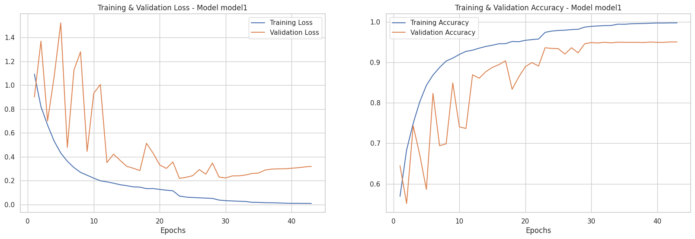

---

**Model 2: CNN Only**


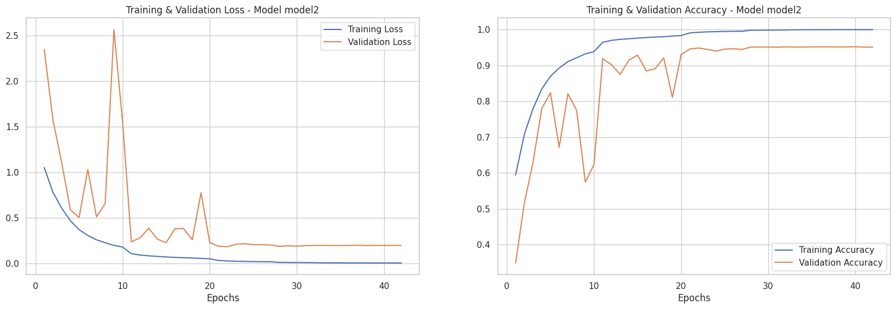

---

**Model 3: CNN and LSTM**


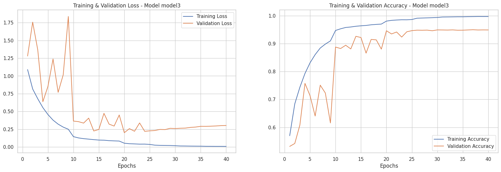

---

**Model 4: CNN and GRU**


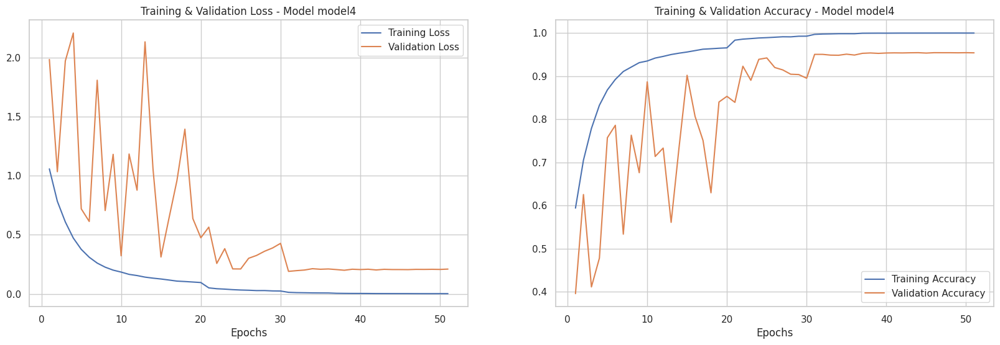

---

**Model 5: CNN, Bidirectional LSTM, Bidirectional GRU with Multi-Head Attention**

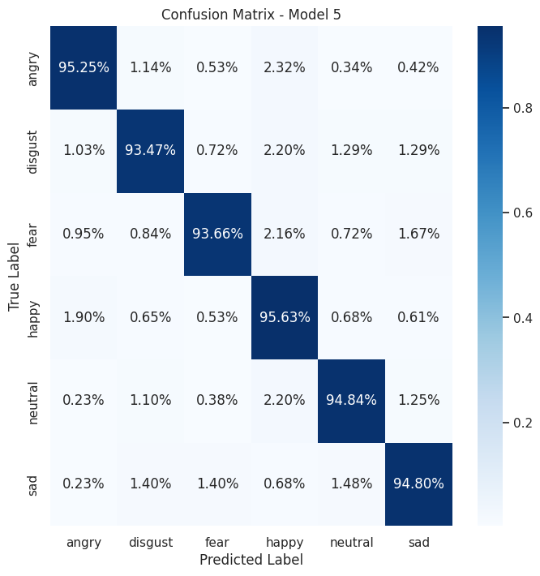

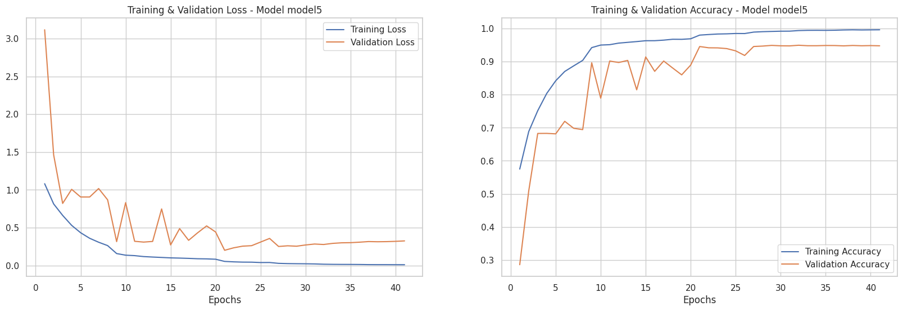

## Ensemble Model - Majority voting

* Individual Model Predictions: Each model in the ensemble independently, and then processes the input data and provides its prediction for the target variable, therefore each model gets a vote.
* Majority Vote: The final prediction is determined by a majority vote among each model. The emotion that receives the most votes will become final prediction. 
* If the final vote is tied, then the code will randomly select one of the tied classes as the final prediction, to counteract this issue a confidence threshold will be introduced.


```python
# Function for majority voting
def majority_vote(predictions):
    # Convert predictions to an array
    predictions_array = np.array(predictions)

    # Use np.argmax to find the index with the maximum occurrence
    majority_index = np.argmax(np.bincount(predictions_array))

    # Return the majority voted class
    return majority_index

# List to store the loaded models
ensemble_models = []

# Paths to the ensemble model files
ensemble_paths = [
    "/path_to_model/ensemble_full_v1_model1.h5",
    "/path_to_model/ensemble_full_v1_model2.h5",
    "/path_to_model/ensemble_full_v1_model3.h5",
    "/path_to_model/ensemble_full_v1_model4.h5",
    "/path_to_model/ensemble_full_v1_model5.h5"

]

# Load each model and add it to the ensemble
for path in ensemble_paths:
    model = load_model(path)
    ensemble_models.append(model)

```
# Testing on Real World Data

To ensure transparency and research integrity, it is crucial that the data is treated identically to the model building phase, with the same features extracted and the same standardisation techniques applied, such as using the same sample rate.

## Cross Corpora
Cross-Corpora testing, in the context of SER systems, entails training a model on multiple datasets and then evaluating it on a separate dataset, in this instance, the TESS dataset. The TESS dataset offers the advantage of including an emotion, Surprise, not used in the model, which will be assessed after predicting the six emotions included in the model.

**Confusion Matrix for Cross Corpora - Excluding Surprise** 

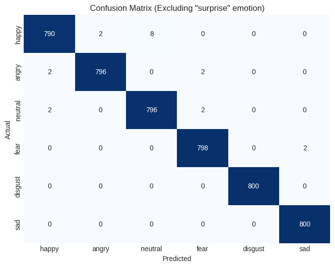

**Bar Chart for Cross Corpora - Surprise only**

In the next experiment, predictions are made on the surprise emotion only. These predictions may be inaccurate, but they provide valuable insights into the model’s ability to generalise. The model most frequently predicts happiness for surprise samples. This is followed by disgust. When considering emotions that are perceived to be similar to surprise, these predictions align with our intuition.

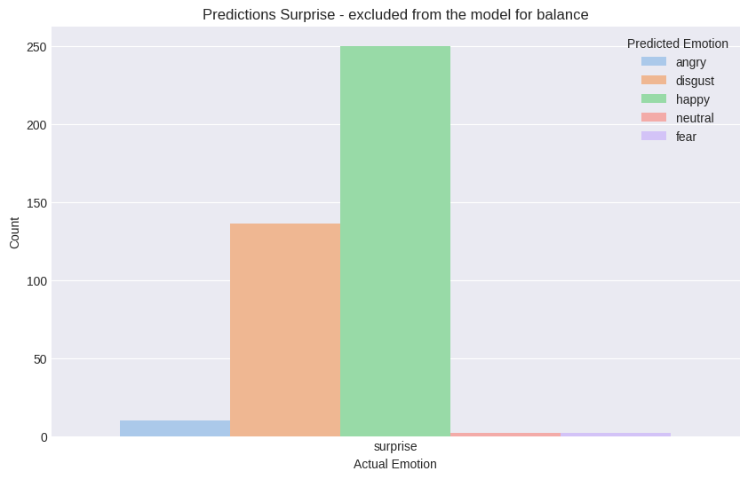

---

## Window & hopw sizes for variable lenghts - NB!!

Window and hop sizes are crucial for examining variable length audio, with the intgeration of attention mechanisms in the models, this allows you to uses various levels of paremeters depedning on the granualrity/ dept / level of emtions you want to extract.

* Window size: The window size determines how long each segment of audio is analysed for emotion. A larger window size provides information for analysis but comes with increased computational complexity.
* Hop size: The hop size determines the overlap between windows. A smaller hop size means windows, which can enhance prediction accuracy by providing a smoother representation of the audio signal.
* Confidence threshold: The confidence threshold sets a level at which predictions are considered valid. A higher confidence threshold filters out predictions but may also result in missing some true positive emotions.

```python
# Function for consistent audio preprocessing
def preprocess_long_audio(audio_file_path, target_sr=16000, window_size=None, hop_size=None):
    if window_size is None or hop_size is None:
        raise ValueError("Both window_size and hop_size must be provided.")
    data, sr = librosa.load(audio_file_path, sr=target_sr, duration=None)

    # Trim silences
    trimmed_data = trim_silences(data, sr)

    # Normalize the audio
    normalized_data = normalize_audio(trimmed_data)

    # Calculate parameters for sliding windows
    window_samples = int(window_size * target_sr)
    hop_samples = int(hop_size * target_sr)

    # Extract sliding windows
    windows = [normalized_data[i:i + window_samples] for i in range(0, len(normalized_data) - window_samples + 1, hop_samples)]

    # Print processed information
    print(f"Original Duration: {len(trimmed_data) / sr:.2f} seconds")
    print(f"Number of Windows: {len(windows)}")

    return windows, sr
```


## Music - Johnny Cash 'Hurt'

**Video - hosted on youtube**

[](https://www.youtube.com/watch?v=8AHCfZTRGiI)

Johnny Cash’s haunting ballad, originally by Nine Inch Nails, transformed into an anthem of loss and regret. Despite its melancholy, the song offers self-awareness and acceptance. Happiness is an emotion predicted by the model, outwardly this could be interpreted as incorrect, but if you listen to the songs message of self-awareness and introspection, this can be interpreted as a form of growth. The song acknowledges the inevitability of pain and suffering in life, but it also suggests a quiet acceptance of these realities. In this sense, happiness can be found in the peace surrendering and the absence of denial. Cash released it in 2002, passing away 13 months later

**Bar Chart with Emtions**

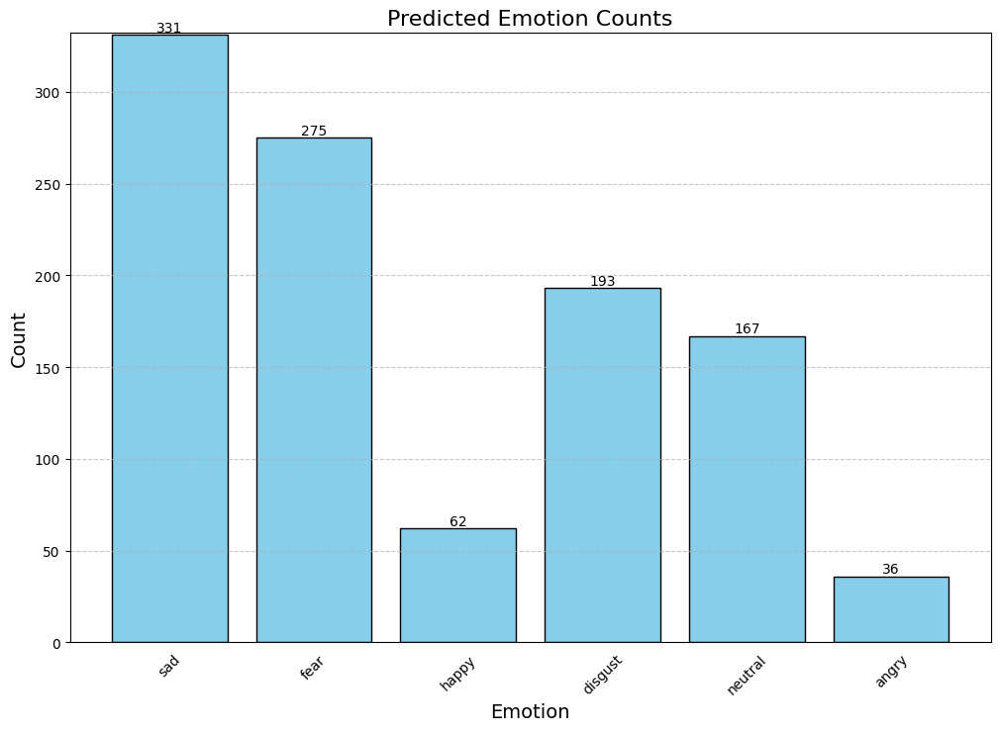

---

## Trump vs The Media

**Video - hosted on youtube**

[](https://www.youtube.com/watch?v=xDdTKBphRMs)

**Radar Chart with Emtions**

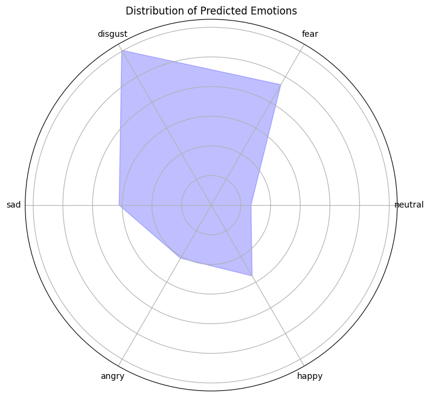


---

## 1st Debate


## How to Run

1. **Set up environment:** (List dependencies, Python version, etc.)
2. **Download datasets:** (If applicable, provide download instructions)
3. **Execute ensemble_full_final:** (Explain any arguments or parameters required)
4. **Run Predictor_final:** (Explain any arguments or parameters required)

## Future Work

* (List potential areas for improvement or expansion)

## Contact

* (Provide your contact information for questions or feedback) 
