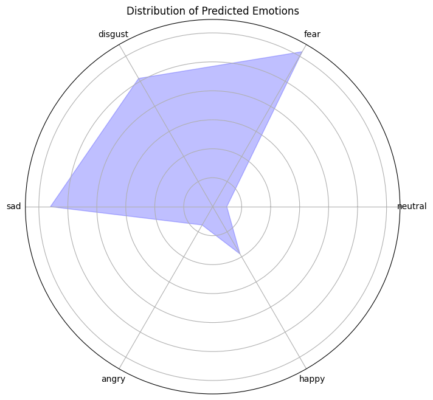
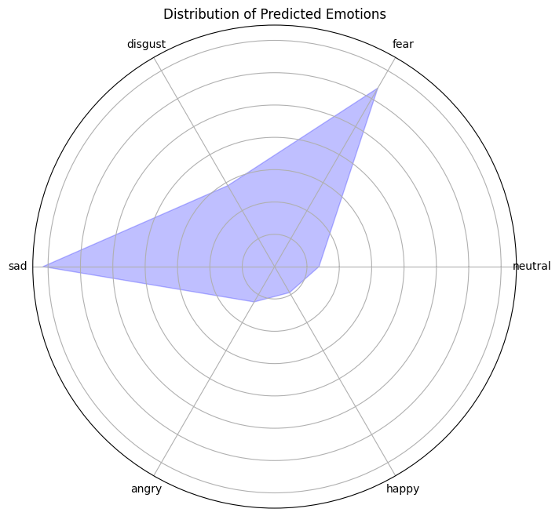
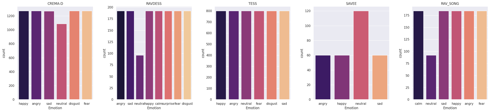
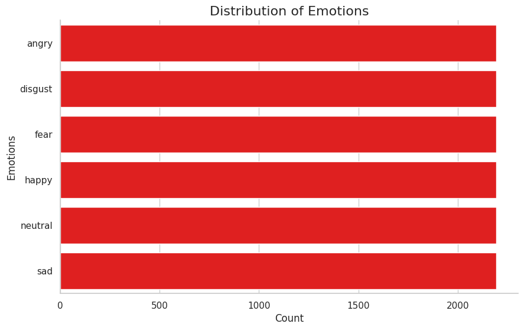
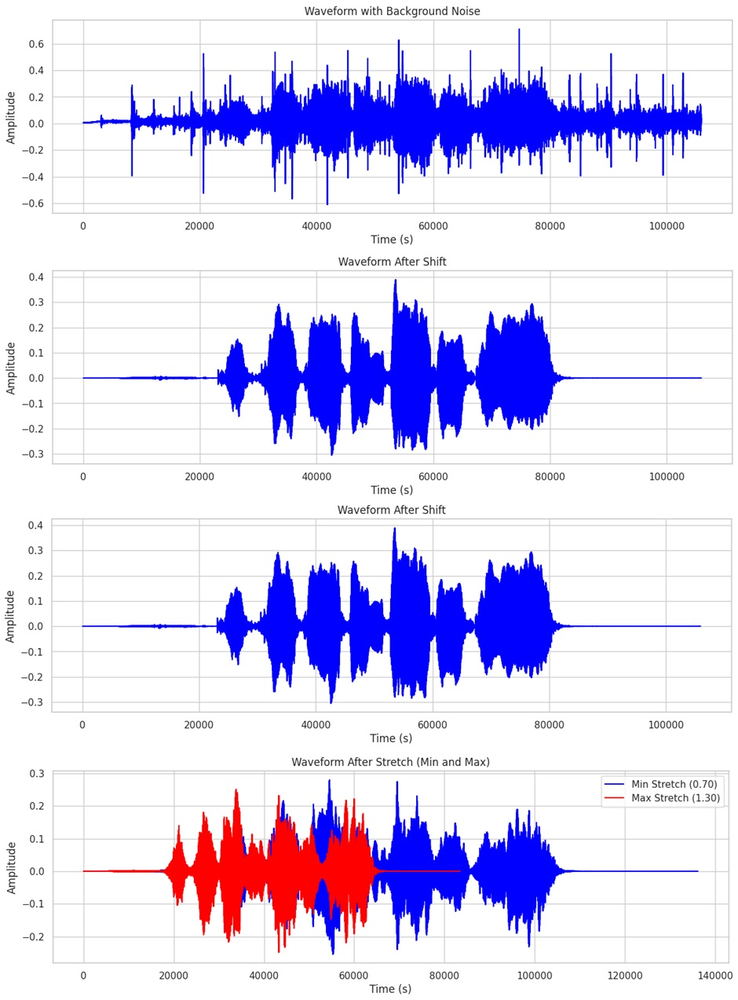

# Speech Emotion Detection - Neural Network Ensemble Model

## Introduction

This project explores the development of a neural network ensemble model for effective speech emotion detection. By utilising diverse datasets, employing advanced feature extraction techniques, and developing robust a machine learning model, SER system capable of identifying and classifying a wide range of emotions has been usccessfully dveloped. The ultimate goal was to develop a Sentiment Emotion Recognition (SER) system for analyzing political discourse. This involved iterative testing until finally applying it to the 1st debate between Trump and Biden.


## Key Result - 1st Debate Biden & Trump - Final Segment

The key result is based on a video and transcript 2020 Joe Biden Donald Trump 1st Debate Part 2 (2020), hosted on rev.com and specifically the final segment. This section of the debate was used as they are both addressed the same question, both given the same amount of time by the host to answer, two minutes, and therefore this can be considered a clean comparison. For this reason, we do not see the ‘Anger’ spike noted and discussed widely from this debate, at no time do they interpret each other during this segment. 

* window_size = 1.0
* hop_size = 0.2
* confidence_threshold =0.7

**Trump Radar Chart**



---

**Biden Radar Chart**



Radar charts offer a valuable method for visually representing the emotional content conveyed during debates. They suggest that both Trump and Biden displayed negative emotions, but Trump's disgust was more noticeable. This finding aligns with previous studies on political communication, indicating that voters tend to be influenced more by negative emotions than positive ones.


## Datasets

* Ravdess [Sample Audio File](./soundfiles/ravdess.wav)
* Ravdess Song [Sample Audio File](./soundfiles/rav_song.wav)
* SAVEE [Sample Audio File](./soundfiles/savee.wav)
* CREMA D [Sample Audio File](./soundfiles/CremaD.wav)
* TESS [Sample Audio File](./soundfiles/tess.wav)

*Disclaimer: Audio files cannot be directly played within the README.Please click the links to download and listen to the sample files.*

**All Datasets with Emotions**


---

**Final Balanced Dataset with 6 emtions**



## Methodology

**Data Augmentation:**
* **add_echo()**: Adds an echo effect to the audio, simulating sound reflections.
* **add_background_noise()**: Mixes in realistic background noise from a provided audio file.
* **match_duration() / match_length()**: Makes audio clips a consistent length by repeating or trimming the audio.
* **add_reverb()**: Simulates reverberation, creating the sense of audio occurring within a space.
* **stretch()**: Changes the speed of the audio without affecting its pitch.
* **shift()**: Applies a circular time shift to the audio.
* **pitch()**: Changes the pitch of the audio without affecting the speed.




**Feature Extraction:** 
* **MFCCs (Mel-Frequency Cepstral Coefficients):** Capture the shape of the vocal tract, commonly used in speech recognition and other audio tasks.
* **Delta MFCCs:** Measure the changes in MFCCs over time, providing dynamic information.
* **Acceleration MFCCs:**  Calculate the second-order derivative of MFCCs, emphasizing higher-order spectral changes.
* **Mel Spectrogram:** A visual representation of the audio's frequency content over time, useful for analyzing various audio patterns.
* **FRFT (Fractional Fourier Transform):** A generalization of the Fourier transform, it allows extracting features at intermediate points between the time and frequency domains.
* **Spectral Centroid:**  Indicates where the "center of mass" of the spectrum is located, related to the brightness of the sound.


**Model Preparation:**
* **Loading and Resampling:** Loads audio files and resamples them to a consistent sample rate. 
* **Silence Trimming:** Removes leading and trailing silence from the audio.
* **Normalization:** Adjusts audio amplitude to a standard range.

# Neural Network Ensemble Architecture

This project utilizes an ensemble of neural networks for enhanced performance and robustness. The ensemble includes the following models:

**Model 1: CNN, LSTM, GRU with Attention** 
* Employs a Convolutional Neural Network (CNN) for feature extraction.
* Includes Long-Short Term Memory (LSTM) and Gated Recurrent Unit (GRU) layers to process sequential data.
* Incorporates an attention mechanism to focus on the most relevant features.


**Model 2: CNN Only**
* Features a streamlined CNN-based architecture for feature extraction.


**Model 3: CNN and LSTM**
* Combines CNN feature extraction with an LSTM layer for processing sequences and potentially capturing longer-term dependencies.


**Model 4: CNN and GRU**
* Employs CNN for feature extraction, followed by a Gated Recurrent Unit (GRU) layer for sequential processing (an alternative to the LSTM in Model 3).


**Model 5: CNN, Bidirectional LSTM, Bidirectional GRU with Multi-Head Attention**
* Leverages CNN for feature extraction.
* Utilizes bidirectional LSTM and GRU layers for capturing information from both past and future contexts.
* Employs multi-head attention to focus on various aspects of 

```python

from keras.layers import Flatten
import tensorflow as tf
from tensorflow.keras.layers import (
    Input, Conv2D, BatchNormalization, Activation, MaxPooling2D,
    GlobalAveragePooling2D, Dense, Dropout, LSTM, Bidirectional,
    Reshape, Attention, GRU
)
from tensorflow.keras.callbacks import (
    EarlyStopping, ReduceLROnPlateau, ModelCheckpoint, TensorBoard
)
from sklearn.model_selection import train_test_split
from sklearn.preprocessing import LabelEncoder, MinMaxScaler
from tensorflow.keras.utils import to_categorical
from tqdm import tqdm

from tensorflow.keras.layers import (
    Input, Conv2D, BatchNormalization, Activation, MaxPooling2D,
    GlobalAveragePooling2D, Dense, Dropout, LSTM, Bidirectional,
    Reshape, Attention, GRU
)
from tensorflow.keras.callbacks import (
    EarlyStopping, ReduceLROnPlateau, ModelCheckpoint, TensorBoard
)


from tensorflow.keras.layers import (
    Input, Conv2D, BatchNormalization, Activation, MaxPooling2D,
    GlobalAveragePooling2D, Dense, Dropout, LSTM, Bidirectional,
    Reshape, Attention, GRU
)
from tensorflow.keras.callbacks import (
    EarlyStopping, ReduceLROnPlateau, ModelCheckpoint, TensorBoard
)

# Define input layer
input_layer = Input(shape=(X_train.shape[1], X_train.shape[2], 1))

# Function to create CNN model
def create_cnn_model(input_layer):
    conv1 = Conv2D(512, kernel_size=(5, 5), strides=(1, 1), padding='same')(input_layer)
    bn1 = BatchNormalization()(conv1)
    relu1 = Activation('relu')(bn1)
    pool1 = MaxPooling2D(pool_size=(2, 2), strides=(2, 2), padding='same')(relu1)

    conv2 = Conv2D(256, kernel_size=(5, 5), dilation_rate=(2, 2), padding='same')(pool1)
    bn2 = BatchNormalization()(conv2)
    relu2 = Activation('relu')(bn2)
    pool2 = MaxPooling2D(pool_size=(2, 2), strides=(2, 2), padding='same')(relu2)

    conv3 = Conv2D(128, kernel_size=(3, 3), dilation_rate=(2, 2), padding='same')(pool2)
    bn3 = BatchNormalization()(conv3)
    relu3 = Activation('relu')(bn3)
    pool3 = MaxPooling2D(pool_size=(2, 2), strides=(2, 2), padding='same')(relu3)

    conv4 = Conv2D(64, kernel_size=(3, 3), padding='same')(pool3)
    bn4 = BatchNormalization()(conv4)
    relu4 = Activation('relu')(bn4)
    pool4 = MaxPooling2D(pool_size=(2, 2), strides=(2, 2), padding='same')(relu4)

    global_avg_pooling = GlobalAveragePooling2D()(pool4)
    return global_avg_pooling

# Function to create LSTM model
def create_lstm_model(input_layer):
    lstm1 = LSTM(256, return_sequences=True)(input_layer)
    lstm2 = LSTM(128, return_sequences=True)(lstm1)
    lstm3 = LSTM(64)(lstm2)

    dropout = Dropout(0.3)(lstm3)
    return dropout

# Function to create model with attention
def add_attention_layer(layer):
    attention = Attention()([layer, layer])
    return attention

# Function to create and compile a model
def create_and_compile_model(input_layer, output_layer, optimizer='adam', loss='categorical_crossentropy', metrics=['accuracy']):
    model = tf.keras.Model(inputs=input_layer, outputs=output_layer)
    model.compile(optimizer=optimizer, loss=loss, metrics=metrics)
    return model

# Function to create multi-head attention layer
def create_multi_head_attention(layer, heads=8):
    attention_heads = []
    for _ in range(heads):
        attention_head = Attention()([layer, layer])
        attention_heads.append(attention_head)
    merged_attention = tf.keras.layers.Concatenate(axis=-1)(attention_heads)
    return merged_attention

# Create Model 1: CNN, LSTM, GRU with Attention
cnn_output = create_cnn_model(input_layer)
reshape1 = Reshape((1, 64))(cnn_output)  # Adjust the shape to maintain the total size
bidirectional_lstm = Bidirectional(LSTM(128, return_sequences=True))(reshape1)
attention_lstm = add_attention_layer(bidirectional_lstm)
bidirectional_gru = Bidirectional(GRU(64, return_sequences=True))(attention_lstm)
attention_gru = add_attention_layer(bidirectional_gru)
attention_flatten = tf.keras.layers.Flatten()(attention_gru)
output_layer_1 = Dense(units=6, activation='softmax')(attention_flatten)
model1 = create_and_compile_model(input_layer, output_layer_1)

# Create Model 2: Only CNN
cnn_output = create_cnn_model(input_layer)
output_layer_2 = Dense(units=6, activation='softmax')(cnn_output)
model2 = create_and_compile_model(input_layer, output_layer_2)

# Create Model 3: CNN and LSTM
cnn_output_3 = create_cnn_model(input_layer)
reshape_3 = Reshape((4, 16))(cnn_output_3)
bidirectional_lstm_3 = Bidirectional(LSTM(128, return_sequences=True))(reshape_3)
attention_lstm_3 = add_attention_layer(bidirectional_lstm_3)

# Flatten the output of attention_lstm_3
flatten_3 = Flatten()(attention_lstm_3)
output_layer_3 = Dense(units=6, activation='softmax')(flatten_3)
model3 = create_and_compile_model(input_layer, output_layer_3)

# Create Model 4: CNN and GRU
cnn_output_4 = create_cnn_model(input_layer)
output_layer_4 = Dense(units=6, activation='softmax')(cnn_output_4)
model4 = create_and_compile_model(input_layer, output_layer_4)

# Create Model 5 with Multi-Head Attention: CNN, Bidirectional LSTM, Bidirectional GRU
cnn_output_5 = create_cnn_model(input_layer)
reshape_5 = Reshape((1, 64))(cnn_output_5)  # Adjust the shape to maintain the total size
bidirectional_lstm_5 = Bidirectional(LSTM(128, return_sequences=True))(reshape_5)
bidirectional_gru_5 = Bidirectional(GRU(64, return_sequences=True))(bidirectional_lstm_5)

# Apply multi-head attention to the output of Bidirectional GRU
multi_head_attention_5 = create_multi_head_attention(bidirectional_gru_5, heads=4)
attention_flatten_5 = tf.keras.layers.Flatten()(multi_head_attention_5)
output_layer_5 = Dense(units=6, activation='softmax')(attention_flatten_5)

model5 = create_and_compile_model(input_layer, output_layer_5)
```

## Results

* Summarize performance metrics


* Discuss key findings from cross-corpora testing.

## Code Structure

* **ensemble_full_final:** (Explain the purpose of this file)
* **Predictor_final:** (Describe the functionality of this file)

## How to Run

1. **Set up environment:** (List dependencies, Python version, etc.)
2. **Download datasets:** (If applicable, provide download instructions)
3. **Execute ensemble_full_final:** (Explain any arguments or parameters required)
4. **Run Predictor_final:** (Explain any arguments or parameters required)

## Future Work

* (List potential areas for improvement or expansion)

## Contact

* (Provide your contact information for questions or feedback) 
